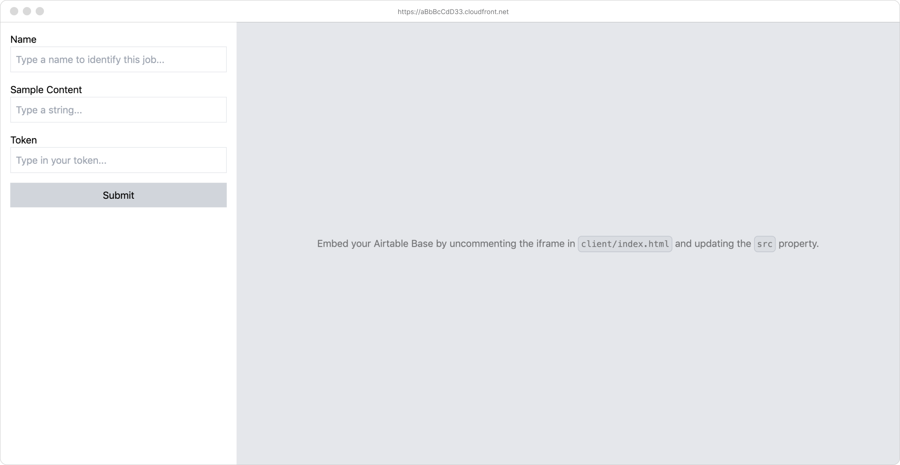

# aws-cdk-batch-ts

Quickly deploy a barebones Typescript client app with a Lambda backend and S3 Bucket that can run jobs in a Docker container on [AWS Batch](https://docs.aws.amazon.com/batch/latest/userguide/what-is-batch.html) with Fargate.



**Features**

- Live serverless development and one line deployment with [SST](https://sst.dev/)
- Vanilla Typescript ready client, built with [Vite](https://vitejs.dev/guide/)
- Run your processing scripts locally with [ESbuild](https://github.com/esbuild-kit/esm-loader).
- Optional project wide type validation using [Zod](https://github.com/colinhacks/zod#basic-usage)
- Pre-configured `BatchConstruct` for managing [Batch resources](https://docs.aws.amazon.com/cdk/api/v2/docs/aws-batch-alpha-readme.html)

**Motivation**

Sometimes all you need is some simple UI and the ability to run scripts that take [more than 15 minutes to complete](https://stackoverflow.com/a/43364402/2619349) without leaving your laptop running. I found that embedding an [Airtable](https://airtable.com/) [base](https://support.airtable.com/docs/creating-a-new-empty-base) into a webpage while using AWS Batch for processing is a simple and effective way of achieving this.

## Quick Start

Make sure you have [installed and configured the AWS CLI](https://docs.aws.amazon.com/cli/latest/userguide/getting-started-install.html). You might find [this guide](https://sst.dev/guide.html) helpful if you're new to serverless development. You may also want to [install Docker](https://docs.docker.com/engine/install/).

Name your stack in the `sst.json` file. Rename `.example.env` file in the root to `.local.env` and populate it it with your credentials. Because the client is publicly exposed, basic authentication is provided via the `Token` input, which matches against the `CLIENT_TOKEN` environment variable in the lambda handler to prevent unauthorised users submitting jobs.

Install the dependencies with yarn:

```
> yarn
```

Develop locally with the [debug stack](https://docs.sst.dev/live-lambda-development) by running the client and services processes separately:

```
> yarn start:services

> yarn start:client
```

You can also run your processing script locally by running `yarn start` in `/services`.

Watch and build shared types package:

```
> yarn tsc --watch
```

And when you're ready, deploy with:

```
> yarn deploy
```

If you have Docker installed, you can build and run the docker container locally with the following commands:

```
# Build
> yarn docker:build

# Run
> yarn docker:run
```

## Airtable

When using the Airtable utility, you may want to update the **Entry** type in `services/lib/airtable.ts` to reflect your column types.You may also want to uncomment the iframe code in `client/index.html` and update the `src` property with the iframe url for your table. Note that Airtable doesn't automatically update when loaded inside an iframe so a refresh button is provided. The iframe is also programatically refreshed when data is submitted.

## References

- https://docs.sst.dev/
- https://sst.dev/guide.html
- https://docs.sst.dev/constructs
- https://docs.aws.amazon.com/batch/latest/userguide/job_queues.html
- https://docs.aws.amazon.com/batch/latest/userguide/job_definition_parameters.html
- https://github.com/aws-samples/aws-cdk-deep-learning-image-vector-embeddings-at-scale-using-aws-batch
